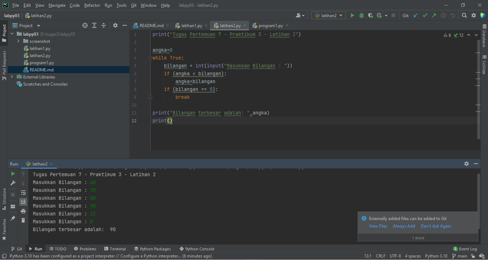

# labpy03
## Praktikum 3
### Berikut Program
    1.latihan
1. Tampilkan n bilangan acak yang lebih kecil dari 0.5.
2. nilai n diisi pada saat runtime
3. anda bisa menggunakan kombinasi while dan for untuk menyelesaikannya
4. gunakan fungsi random() yang dapat diimport terlebih dahulu
Berikut gambar program nya:

output ada di gambar

Algoritma nya:

 
    import random

    print(40 * "=")
    print("Bilangan random yang lebih kecil dari 0,5")
    print(40 * "=")
    jum = int(input("Masukan nilai n : "))
    i = 0
    for i in range(jum):
    i += 1
    angkaDec = random.uniform(0, 0.5)
    print("Data ke", i, " = ", angkaDec)

    
    
    latihan2.py
Buat program untuk menampilkan bilangan terbesar dari n buah data yang diinputkan.
Masukkan angka 0 untuk berhenti

Berikut gambar nya

Algoritma:

    
    print("Tugas Pertemuan 7 - Praktikum 3 - Latihan 2")

    angka=0
    while True:
        bilangan = int(input("Masukkan Bilangan : "))
        if (angka < bilangan):
        angka=bilangan
        if (bilangan == 0):
        break

    print("Bilangan terbesar adalah: ",angka)
    print()

    
    PROGRAM 1

Buat program sederhana dengan perulangan: program1.py
Seorang pengusaha menginvestasikan uangnya untuk memulai usahanya dengan
modal awal 100 juta, pada bulan pertama dan kedua belum mendapatkan laba. pada
bulan ketiga baru mulai mendapatkan laba sebesar 1% dan pada bulan ke 5,
pendapatan meningkat 5%, selanjutnya pada bulan ke 8 mengalami penurunan
keuntungan sebesar 2%, sehingga laba menjadi 3%. Hitung total keuntungan selama 8
bulan berjalan usahanya

Algoritma nya:

    a = 100000000
    for i in range(1, 9):
        if (i >= 1 and i <= 2):
            b = a * 0
            print("Laba bulan ke -", i, " = ", b)
        if (i >= 3 and i <= 4):
            c = a * 0.1
            print("Laba bulan ke -", i, " = ", c)
        if (i >= 5 and i <= 7):
            d = a * 0.5
            print("Laba bulan ke -", i, " = ", d)
        if (i == 8):
            e = a * 0.2
            print("Laba bulan ke -", i, " = ", e)
            total = b + b + c + c + d + d + d + e
            print("\nTotal : ", total)

Selesai Terimakasih Wassalamualaikum wr wb
